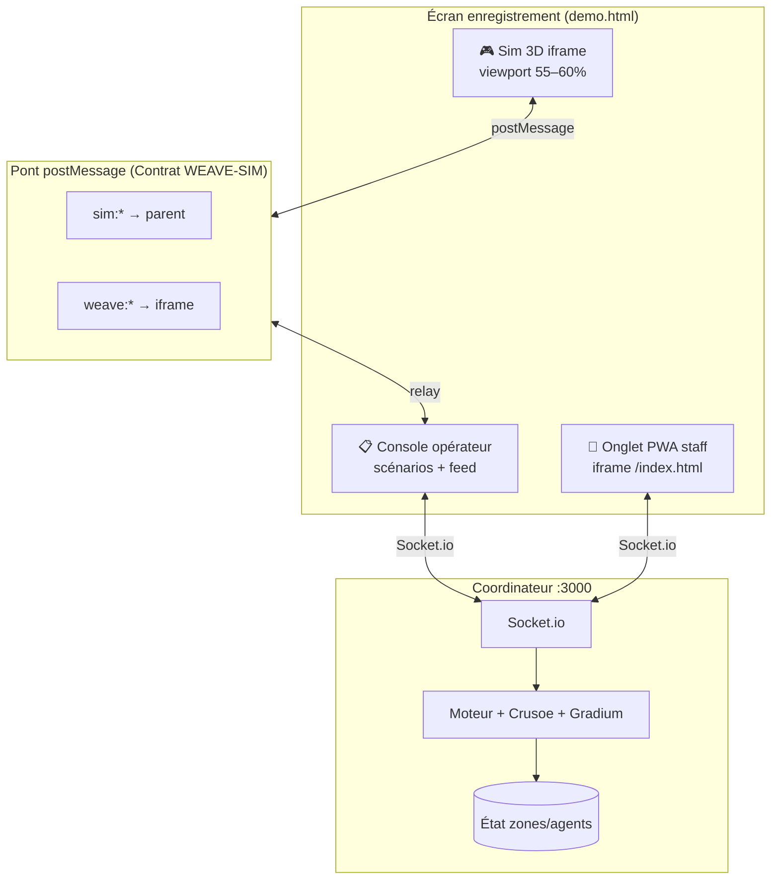
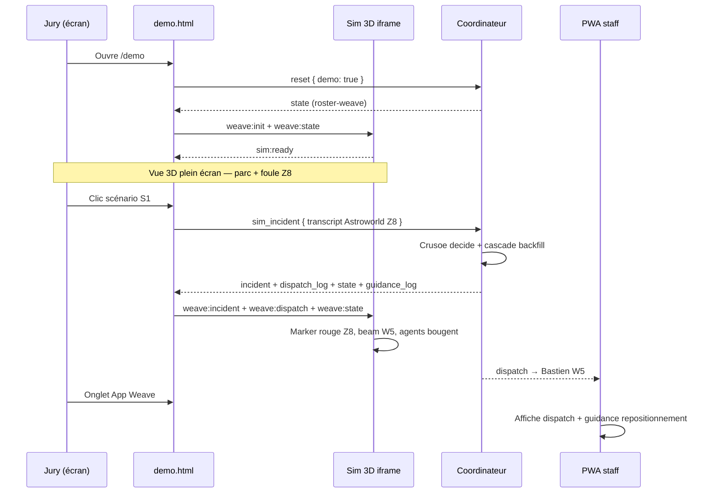

# Architecture démo jury — Simulation 3D au centre

> **Objectif** : enregistrement écran 2–3 min pour le jury RAISE / Weave.  
> **Principe** : la sim 3D (P2 Prakash) est la **vue primaire** ; le coordinateur Weave est le **cerveau** ; la PWA staff est l’**onglet terrain**.

---

## 1. État des lieux

### 1.1 Sim 3D (`origin/3dSimulator`)

| Aspect | Détail |
|--------|--------|
| Stack | Vite + Three.js, app **standalone** (`npm run dev` → `:5173`) |
| API externe | **Aucune** — pas de WebSocket, pas de `postMessage` |
| Moteur | `DispatchEngine` interne (`src/engine.js`) — clone déterministe du moteur Conductor |
| UI opérateur | **Intégrée** dans la sim : panneau droit (boutons incident, decision trace, coverage, approve/why/override) |
| Scénarios natifs | Collapse Grand Huit (Z2), Extreme Ride (Z8), Kids Zone (Z6), rapport ES à l’entrée (Z1), random, clic zone 3D |
| Visuels | Foule instanciée, agents colorés par skill, beams de route, blackspots, ambulance, timeout/reroute, TTS navigateur |
| Roster | Générique A1–A14 + R1–R2 (pas l’équipe Weave) |

**Fichiers clés** : `index.html`, `src/main.js`, `src/engine.js`, `src/data.js`.

### 1.2 Stack Weave (`cursor/realtime-position-guidance`)

| Aspect | Détail |
|--------|--------|
| Coordinateur | `coordinator/src/server.js` — Socket.io, Crusoe, Gradium, moteur cascade |
| Démo jury | `/demo` → `app/public/demo.html` |
| Roster équipe | `data/roster-weave.json` (Nathan, Ibrahim, Ali, Prakash, Bastien, …) |
| Scénarios Astroworld | `data/scenarios-demo.json` (S1–S8) |
| PWA staff | `app/public/index.html` (dispatch, ack, GPS, guidance) |

**Contrat WS gelé** : voir `CONTRACTS.md` (événements `sim_incident`, `state`, `dispatch`, `guidance`, `scan_reposition`, …).

---

## 2. Architecture cible — 3D comme viewport primaire



### Rôles par couche

| Couche | Responsabilité | Source de vérité |
|--------|----------------|------------------|
| **Sim 3D** | Rendu parc, foule, agents, routes, incident visuel, caméra | **Affichage** uniquement en mode bridge |
| **demo.html** | Layout enregistrement, scénarios S1–S8, feed dispatch, relay postMessage ↔ WS | Shell |
| **Coordinateur** | Pipeline incident, dispatch, backfill, guidance, ack, re-route | **État + décisions** |
| **PWA staff** | Réception dispatch, accusé, repositionnement GPS | Terrain simulé |

> En mode démo enregistrée : **désactiver** le `DispatchEngine` interne de la sim (ou le bypasser) pour éviter deux cerveaux qui divergent.

---

## 3. Contrat d’événements WEAVE-SIM (postMessage)

Origine cible : `https://localhost:3000` (parent) ↔ `http://127.0.0.1:5173` (iframe dev).

### 3.1 Sim → Parent (`sim:*`)

```javascript
// Sim prête à recevoir l'état Weave
{ type: 'sim:ready', payload: { version: '1' } }

// Clic zone 3D ou bouton incident natif (mode bridge)
{ type: 'sim:incident_request', payload: {
  zoneId: 'Z8',
  transcript: '...',  // optionnel — sinon le parent utilise scenarios-demo
  lang: 'fr'
}}

// Accusé simulé depuis la 3D (optionnel, pour démo visuelle)
{ type: 'sim:ack', payload: { assignmentId: 'as_1' } }
```

### 3.2 Parent → Sim (`weave:*`)

```javascript
{ type: 'weave:init', payload: { mode: 'bridge', roster: 'weave' } }

// Snapshot complet après chaque changement
{ type: 'weave:state', payload: { agents, zones, incidents, assignments } }

// Incident créé (pour marker 3D + caméra follow)
{ type: 'weave:incident', payload: { id, zone_id, type, severity, primary_id, transcript } }

// Dispatch émis (beam primary/backfill)
{ type: 'weave:dispatch', payload: {
  assignmentId, incidentId, role, targetZone, agentId, text
}}

// Guidance repositionnement
{ type: 'weave:guidance', payload: { agentId, targetZone, message, reason } }

{ type: 'weave:coverage_warning', payload: { zoneId, message } }

{ type: 'weave:reset' }
```

### 3.3 Mapping zones Astroworld → sim 3D

Les deux stacks partagent **Z1–Z10** et la même topologie d’adjacence.

| Scénario | `zone_hint` | Zone 3D | Attractions visibles |
|----------|-------------|---------|----------------------|
| S1 densité ignorée | Z8 | Manège Extrême | Tour + foule dense |
| S2 RCP crush point | Z8 | Manège Extrême | Patient + beam Bastien (W5) |
| S3 poste médical vide | Z6 | Zone Enfants | Stands kids |
| S4 langue étrangère | Z8 | Manège Extrême | Pipeline EN → TTS FR |
| S5 cascade backfill | Z5 | Place Centrale | Foule max (34 instances) |
| S6 retard repositionnement | Z5 | Place Centrale | Scan repo → guidance R3 |

---

## 4. Flux événementiel — S1 crowd crush (Astroworld)



**Narration jury** : « La foule se compacte au manège extrême → Weave route le RCP le plus proche **et** backfill pour ne pas créer de trou — visible en 3D et sur le téléphone staff. »

---

## 5. Layout enregistrement écran

### Recommandé (single monitor, 1920×1080)

```
┌─────────────────────────────────────────────────────────────┐
│  Weave — Démo jury          ● connecté    Astroworld → …   │
├─────────────────────────────────────────────────────────────┤
│                                                             │
│              SIMULATION 3D (55–60% hauteur)                 │
│         Parc, foule, agents, beams, incident pulse          │
│                                                             │
├─────────────────────────────────────────────────────────────┤
│ [Simulation·Opérateur]  [App Weave·Staff]                 │
├─────────────────────────────────────────────────────────────┤
│  Scénarios S1–S8  │  Feed dispatch en temps réel            │
│  Scan repo · Reset│  ↗ guidance · ⚠ coverage               │
└─────────────────────────────────────────────────────────────┘
```

**Timing vidéo (~2 min 30)** :

| Temps | Action | Ce que voit le jury |
|-------|--------|---------------------|
| 0:00–0:20 | Reset, tour caméra 3D | Parc réaliste, équipe positionnée |
| 0:20–0:55 | S1 ou S2 | Incident Z8, dispatch Bastien, backfill |
| 0:55–1:15 | Onglet Staff (Nathan/Bastien) | Dispatch + ack sur PWA |
| 1:15–1:45 | S5 cascade Z5 | Primary + backfill chain en 3D |
| 1:45–2:10 | Scan repositionnement | Guidance R3 → Z5, agents bougent |
| 2:10–2:30 | S4 EN ou S3 Z6 | Multilingue / poste médical |

---

## 6. Déploiement jour J (enregistrement)

### Option retenue : **dual process + postMessage (Option A)**

| Process | Commande | Port |
|---------|----------|------|
| Coordinateur | `cd coordinator && DEMO_ROSTER=true npm start` | 3000 (HTTPS mkcert) |
| Sim 3D | `cd sim3d && npm run dev` | 5173 |

Dans la console navigateur sur `/demo` :

```javascript
window.P2_SIM_URL = 'http://127.0.0.1:5173';
location.reload();
```

Ou variable d’environnement / query `?sim=http://127.0.0.1:5173` (à ajouter si temps).

### Pourquoi pas les autres options seules

| Option | Verdict 48h |
|--------|-------------|
| **A — postMessage** | ✅ **Retenu** — 2 process, patch minimal P2 + demo.html, zéro risque prod |
| **B — WS direct sim→coordinator** | ⚠️ Phase 2 — P2 duplique client Socket.io, conflit avec moteur interne |
| **C — merge monorepo `sim3d/`** | ✅ **Fait en partie** — dossier `sim3d/` + bridge ; `git subtree` du branch P2 |

**Prod** : `/demo` et le bridge sont derrière `DEMO_ROSTER=true` — aucun impact sur le flux prod (`roster.json`).

---

## 7. Structure cible du repo

```text
hackaton-raise/
├── coordinator/           # Cerveau Weave (inchangé prod)
├── app/public/
│   ├── demo.html          # Shell enregistrement + bridge postMessage
│   └── index.html         # PWA staff
├── data/
│   ├── zones.json
│   ├── roster-weave.json  # Équipe hackathon
│   └── scenarios-demo.json
├── sim3d/                 # ← Branch P2 intégrée
│   ├── package.json
│   ├── index.html
│   ├── src/
│   │   ├── main.js        # + import bridge.js en mode WEAVE_BRIDGE
│   │   ├── engine.js      # bypass si bridge actif
│   │   ├── data.js
│   │   ├── bridge.js      # Contrat WEAVE-SIM (stub fourni)
│   │   └── styles.css
│   └── README.md
└── docs/
    └── architecture-demo-3d.md   # ce document
```

**Intégration P2** (une fois) :

```bash
git fetch origin 3dSimulator
git checkout origin/3dSimulator -- sim3d/
# puis copier sim3d/bridge.js et patcher main.js (voir sim3d/README.md)
```

---

## 8. Répartition équipe

| Personne | Rôle | Livrables |
|----------|------|-----------|
| **P2 — Prakash** | Sim 3D | Intégrer `bridge.js` dans `main.js` : mode `WEAVE_BRIDGE`, désactiver dispatch interne, animer depuis `weave:state` / `weave:dispatch`, roster Weave (noms W1–W13), émettre `sim:ready` |
| **P5 — Bastien** | Coordinateur + démo | `demo.html` bridge ✅, `scenarios-demo.json`, `roster-weave.json`, script enregistrement, `DEMO_ROSTER=true` |
| **P3 — Nathan** | PWA staff | Vérifier dispatch/ack/guidance sur agents W1/W5 pendant démo ; préparer fenêtre staff pré-sélectionnée |
| **P4 — Ibrahim** | Mobile / UX terrain | Check-in GPS zones, fluidité onglet staff sur mobile (si second écran) |
| **P1 — Ali** | Crusoe / prompts | Valider transcripts S1–S8 → bon `zone_id` + skills ; tuning multilingue S4/S6 |
| **Tous** | Jour J | `./scripts/record-demo.sh` : lancer les 2 process, ouvrir `/demo`, répéter 2× avant capture |

---

## 9. Script enregistrement (pas à pas)

1. **Préparer** (5 min avant capture)
   ```bash
   # Terminal 1
   cd coordinator && DEMO_ROSTER=true MOCK_CRUSOE=false npm start
   # Terminal 2
   cd sim3d && npm install && npm run dev
   ```
2. Ouvrir `https://localhost:3000/demo` (ou IP LAN pour téléphone staff).
3. Console : `window.P2_SIM_URL='http://127.0.0.1:5173'; location.reload();`
4. Attendre `sim:ready` dans le feed (ou indicateur « Sim 3D connectée »).
5. **Reset démo** → roster équipe chargé.
6. **Activer voix** dans la sim 3D (optionnel, effet waouh).
7. Enregistrer l’écran (QuickTime / OBS, 1920×1080, fenêtre navigateur pleine).
8. Jouer le scénario S1 → montrer 3D → basculer onglet Staff → ack.
9. S5 cascade → Scan repositionnement → clôture S4 ou S6.
10. **Ne pas** montrer les terminals ni les erreurs console.

---

## 10. Prochaines étapes techniques (ordre priorité)

1. ✅ `demo.html` — relay postMessage ↔ Socket.io (stub)
2. ⬜ P2 — `import { initWeaveBridge } from './bridge.js'` + mode bridge dans `main.js`
3. ⬜ P2 — Mapper agents Weave (`W5` Bastien) sur visuels 3D (couleur skill identique)
4. ⬜ P5 — Servir build sim depuis coordinateur (`app.use('/sim3d', static)`) pour single-port en prod démo
5. ⬜ Tests manuels : S1 + S5 + scan repo avec les deux process lancés

---

## Annexe — Événements coordinateur (rappel)

**Client → serveur (démo)** : `sim_incident`, `scan_reposition`, `reset`, `ack`, `position`, `gps_position`

**Serveur → client** : `state`, `incident`, `dispatch_log`, `guidance`, `guidance_log`, `coverage_warning`, `ack_log`, `position_log`

Le bridge `demo.html` traduit `dispatch_log` + `state` + `incident` + `guidance_log` vers `weave:*` pour la sim 3D.
